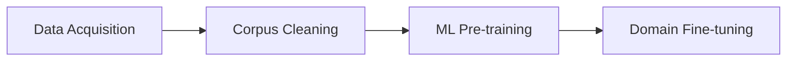
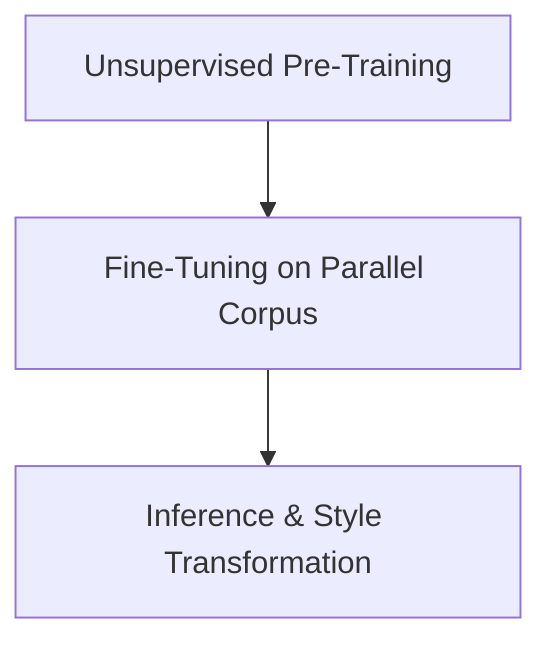

# 🇰🇭 Khmer Text Style Transformer (khmer-tst)

**Bridging the gap between Common Khmer and Royal Registers (Reacheasap)**

   

## 📖 Overview

The **Khmer Text Style Transformer** is an NLP project dedicated to the preservation and digital transformation of the Khmer language's unique sociolinguistic registers. Specifically, it focuses on **Reacheasap (រាជាសព្ទ)** the highly formalized royal register used when referring to or addressing the Monarchy, Clergy, and in classical literature.

### 🎯 Project Objectives

The project automates the transition between everyday vernacular and the sophisticated, honorific-heavy structures of formal Khmer.

---

## 📊 Linguistic Dataset

The core of this project is a parallel corpus of **690+ verified pairs**, capturing the nuance of Khmer honorifics.

| Register   | Example Sentence                                    |
| ---------- | --------------------------------------------------- |
| **Common** | គាត់ឆ្លងកាត់ឆ្នេរសមុទ្រ បានទៅដល់កោះមួយ              |
| **Royal**  | ព្រះអង្គនិមន្ដកាត់តាមឆ្នេរមហាសាគរ បានយាងទៅដល់កោះមួយ |

### Transformation Logic Breakdown

| Word (Common)       | Word (Royal)     | English Equivalent    |
| ------------------- | ---------------- | --------------------- |
| គាត់ (He/She)       | **ព្រះអង្គ**     | His/Her Majesty       |
| ញ៉ាំ (Eat)          | **សោយ**          | To partake (Royal)    |
| មក (Come)           | **យាងមក**        | To proceed / arrive   |

---

## 🧠 Model Training Workflow

The project follows a **two-phase training strategy** to develop a robust Khmer Text Style Transformer. The architecture is based on an **LSTM encoder–decoder framework**, trained progressively to first learn general language structure, then adapt to register-specific nuances.

### **1. Pre-Training Phase**

During this stage, the model is exposed to a **large unpaired Khmer text corpus** to learn the foundational syntax, morphology, and semantics of the language.

**Objective:**
Train the LSTM to predict the next token in a sequence, allowing it to learn contextual representations of Khmer words.

**Setup:**

* **Dataset:** `general-text.txt` (unstructured Khmer corpus)
* **Task:** Next-word prediction (language modeling)
* **Loss Function:** Cross-Entropy Loss
* **Optimizer:** Adam
* **Learning Rate:** 0.001
* **Epochs:** 20–30 (with early stopping)

---

### **2. Fine-Tuning Phase**

After pre-training, the model is fine-tuned on a **parallel corpus of Common–Royal sentence pairs**. This teaches the model to transform sentences from the **Common register** to the **Royal register**, leveraging the linguistic foundation learned during pre-training.

**Objective:**
Adapt the pretrained LSTM for **sequence-to-sequence translation** between registers.

**Setup:**

* **Dataset:** `normal-royal.csv` (690+ aligned sentence pairs)
* **Task:** Text style transfer (Common → Royal)
* **Loss Function:** Cross-Entropy Loss
* **Optimizer:** Adam (lower learning rate for stability)
* **Evaluation Metrics:** BLEU score, perplexity

## 🤗 Hugging Face Resources

* **Normal to Royal Dataset:** [khmer-tst-normal2royal](https://huggingface.co/datasets/k1mhor/khmer-tst-normal2royal)
* **Pre-trained Model:** [khmer-pretrained-lstm](https://huggingface.co/k1mhor/khmer-pretrained-lstm)

---

If this project helps your research, please consider giving it a ⭐!

